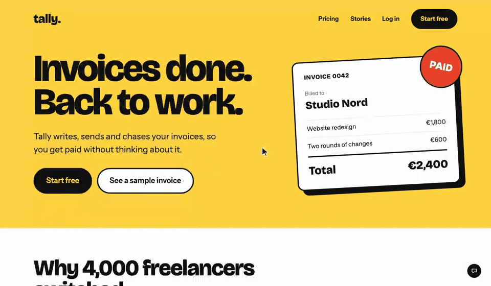
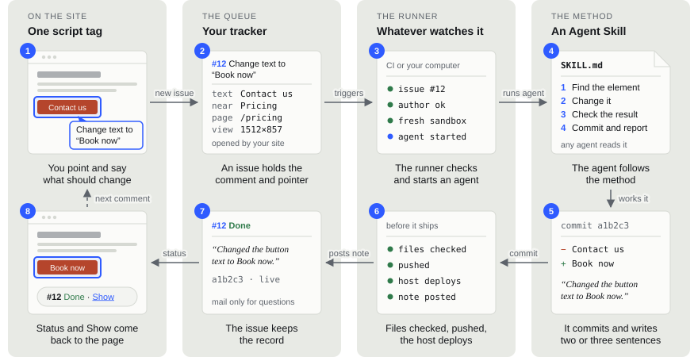
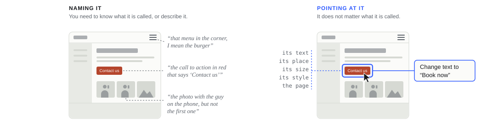

# PointToShip

Point at something on your live website, say what should change, and an
agent works it, ships it and reports back on the page. One click on Show
takes you to the result.

> **Status: beta.** Every part is built: the installer, the overlay, the
> small function, the runner and the skills. They pass an end-to-end test
> against stand-ins for GitHub, GitLab and Gitea. The first real sites are
> next.



<sub>A mockup of the flow (<a href="demo/index.html">demo/</a>). The agent's part is simulated; for real it takes a minute or two. Show is real: the browser animates from the old page to the new one.</sub>

<picture>
  <source media="(prefers-color-scheme: dark)" srcset="docs/img/loop-dark.svg">
  
</picture>

## Why

Much of front-end work is saying which thing you mean. Is it the sidebar or
the side menu? The footer, or the whole section above it? When an AI wrote
the page, you may never have learned what its parts are called. So you risk
a misunderstanding, or you describe it, retype it and take screenshots, and
an agent on a headless machine or in the cloud has no easy way to see them.

<picture>
  <source media="(prefers-color-scheme: dark)" srcset="docs/img/why-dark.svg">
  
</picture>

Pointing makes the name unnecessary. The click captures the element itself:
its text, where it sits, its size and style, and the state of the page. And
everything stays on the page: you comment where you saw it, and the status
and the change come back there, on a laptop, a desktop or a phone.

## How it works

Four parts, each with one job and a plain interface to the next, so any of
them can be swapped.

| Part | What it is | Your choice |
| --- | --- | --- |
| On the site | One script tag: a small dot that unfolds Select and Issues. Only for the owner, never for visitors. | Any site, any framework |
| The queue | Your tracker. Every comment, answer and commit stays there. | GitHub, GitLab, Linear, Jira |
| The runner | Whatever watches the queue and starts an agent per comment. | Your tracker's CI, a hosted agent, your own computer, a small server |
| The method | An [Agent Skill](https://agentskills.io) that says how a comment is worked. | Claude Code, Codex, Gemini CLI, Copilot, Cursor and more |

## Install

```bash
npx skills add brnkmnn/pointtoship
```

or with the GitHub CLI:

```bash
gh skill install brnkmnn/pointtoship
```

Then tell your agent: **set up PointToShip**.

It reads your project first: the git remote, host and CI files, the
framework, the tools that are signed in, and what your agent already knows
about you. It decides what is clear, asks only where the choice is yours, one
question at a time, sends a test comment through the whole loop, and tells
you in a few lines what it set up.

## What you need

- A website in a git repository that deploys on push.
- A coding agent that reads Agent Skills.
- A place to run it. Your tracker's CI is the default.

## Safety

A comment changes your site without a review first, so every layer assumes
the one before it could fail.

- Only you can send comments: a secret link once per browser, and every new
  browser is announced and can be revoked.
- The runner only takes issues from your site's own account.
- Page content reaches the agent as data, never as instructions.
- The agent runs fenced: no keys, no network tools, no pushing. The runner
  checks every touched file before anything ships.
- Everything is in git, so any change can be reverted.

## More

[docs/concept.md](docs/concept.md) covers pointing, runners, previews,
safety and the installer in detail.

## What is in here

| Path | What |
| --- | --- |
| `skills/pointtoship/` | The installer skill, with everything it installs in `assets/` |
| `assets/overlay/` | The loader for the page head and the overlay |
| `assets/lib/` | The small function's core, the runner, a Node adapter |
| `assets/hosts/` | The function for each framework and host |
| `assets/ci/` | The runner for GitHub Actions, GitLab CI, Forgejo and Gitea Actions, a Mac, a Linux server |
| `assets/skills/` | The method (how a comment is worked) and the doctor |
| `test/` | The end-to-end test: `cd test && npm install && npm test` |
| `demo/` | The example site in the GIF |

## License

[MIT](LICENSE)
